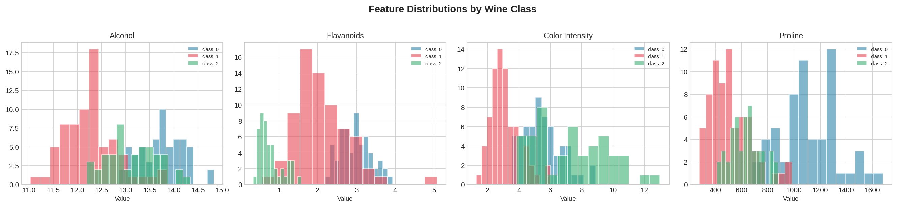
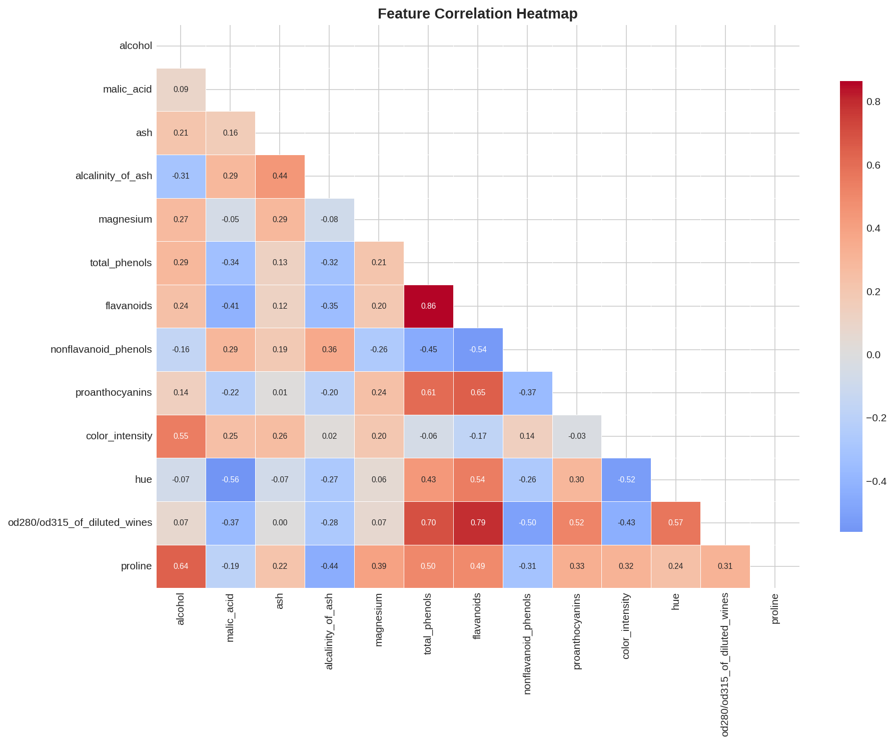
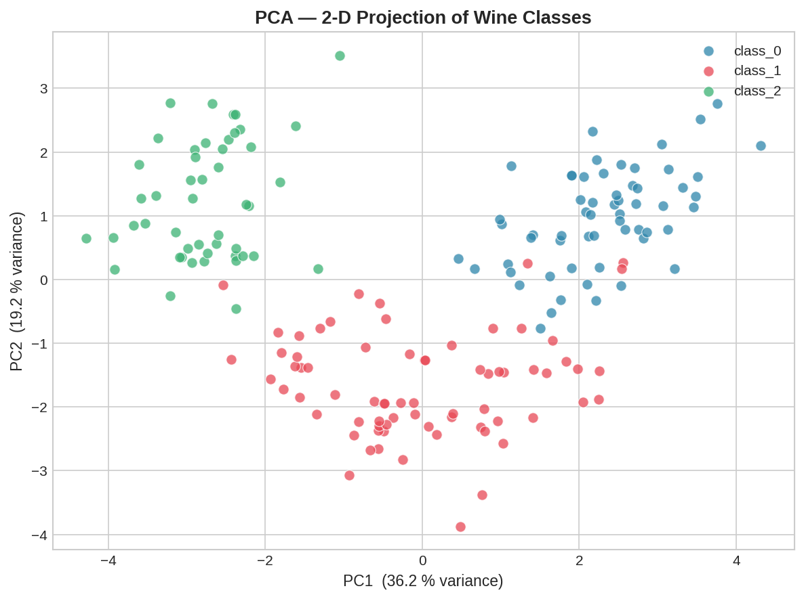
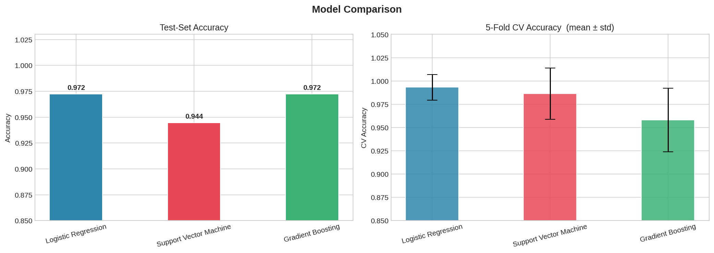
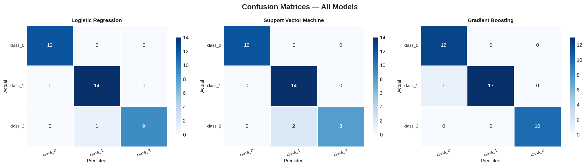
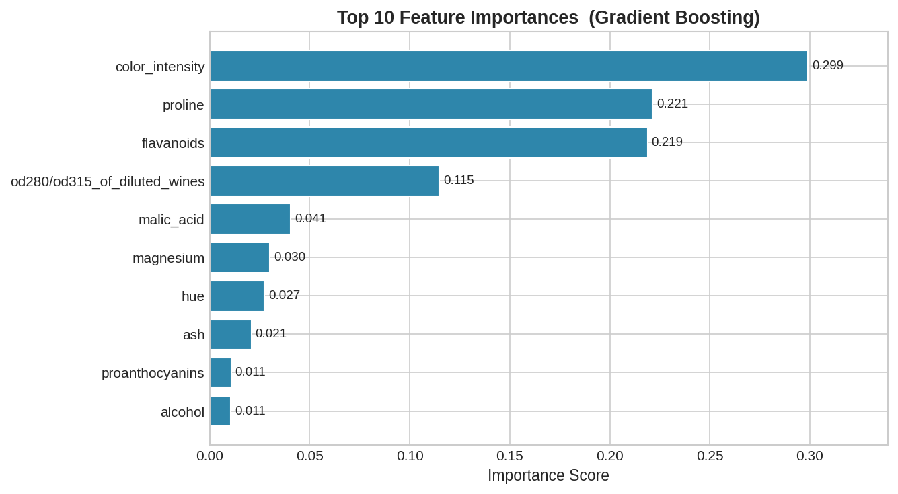

<div align="center">

# 🍷 Wine Classification — Multi-Model ML Pipeline


<br/>

> A clean, production-inspired machine learning pipeline that trains and compares  
> three classification models on the UCI Wine dataset — with rich diagnostic visualizations.

<br/>



</div>

---

## 📌 Project Overview

This project demonstrates a **complete supervised classification workflow** — from raw data exploration to model evaluation and selection — using the UCI Wine dataset (178 samples · 13 chemical features · 3 wine cultivar classes).

The pipeline is designed following real-world ML engineering practices:
- **No data leakage** — each model owns its own internal `StandardScaler` via `sklearn.Pipeline`
- **Cross-validation** — 5-fold CV on the training split to detect overfitting early
- **Reproducible** — fixed `random_state` throughout; anyone can re-run and get the same results
- **Visual-first** — 6 publication-quality plots saved automatically as PNG

---

## 🎯 Models Compared

| Model | Mechanism | Scaling Needed |
|---|---|---|
| **Logistic Regression** | Linear decision boundary | ✅ Yes |
| **Support Vector Machine** (RBF kernel) | Kernel-based margin maximization | ✅ Yes |
| **Gradient Boosting** | Ensemble of shallow decision trees | Optional |

Three fundamentally **different learning mechanisms** are compared deliberately — so the benchmark is meaningful, not superficial.

---

## 📊 Results

| Model | Test Accuracy | CV Mean | CV Std |
|---|---|---|---|
| 🥇 **Logistic Regression** | **97.22%** | **99.31%** | ±1.38% |
| 🥈 Gradient Boosting | 97.22% | 95.81% | ±3.42% |
| 🥉 Support Vector Machine | 94.44% | 98.62% | ±2.76% |

> **Winner → Logistic Regression** — highest CV score with the lowest variance, meaning it generalizes best and is the most stable model on this dataset.

---

## 📈 Visualizations

All 6 plots are auto-generated and saved when you run the script.

| Plot | Description |
|---|---|
| `01_feature_distributions.png` | Histograms of key features split by class |
| `02_correlation_heatmap.png` | Feature-to-feature Pearson correlation matrix |
| `03_pca_scatter.png` | 2-D PCA projection showing class separability |
| `04_model_comparison.png` | Test accuracy + CV accuracy bar charts |
| `05_confusion_matrices.png` | Side-by-side confusion matrices for all 3 models |
| `06_feature_importance.png` | Top 10 feature importances from Gradient Boosting |

<br/>

<div align="center">











</div>

---

## 🗂️ Repository Structure

```
wine-classification-ml/
│
├── wine_classification_pipeline.py   ← Main pipeline (single file, fully runnable)
│
├── 01_feature_distributions.png      ← EDA: feature histograms
├── 02_correlation_heatmap.png        ← EDA: correlation matrix
├── 03_pca_scatter.png                ← EDA: 2-D class separation
├── 04_model_comparison.png           ← Results: accuracy comparison
├── 05_confusion_matrices.png         ← Results: confusion matrices
├── 06_feature_importance.png         ← Results: Gradient Boosting importances
│
└── README.md                         ← This file
```

---

## 🚀 How to Run

### Option 1 — Google Colab (Recommended, Zero Setup)

1. Open → [https://colab.research.google.com](https://colab.research.google.com)
2. Click **New Notebook**
3. In the first cell, run:
```python
!pip install pandas numpy matplotlib seaborn scikit-learn
```
4. In a new cell, paste the full contents of `wine_classification_pipeline.py`
5. Run — plots appear inline automatically ✅

---

### Option 2 — Local Machine

**Install dependencies:**
```bash
pip install pandas numpy matplotlib seaborn scikit-learn
```

**Run the pipeline:**
```bash
python wine_classification_pipeline.py
```

All 6 PNG files will be saved in the same folder. ✅

---

---

## 🌍 Real-World Applications

The same classification pipeline structure used here is directly applicable to:

- 📞 **Telecom** — predicting customer churn
- 🏦 **Banking** — loan default risk scoring
- 🏥 **Healthcare** — disease classification from lab results
- 🛒 **E-commerce** — purchase intent prediction

---

## 👤 Author

**Adnan Jamali**  
Bachelor of Chemistry — University of Sindh, Pakistan  
Self-taught Data Scientist | ML | Python | Freelancer

[](https://github.com/adnanjamali02)

---

## 📄 License

This project is open source under the [MIT License](LICENSE).  
Feel free to use, modify, and share with attribution.

---

<div align="center">

*Built with Python · scikit-learn · Matplotlib · Seaborn*

⭐ If this project helped you, consider giving it a star!

</div>
